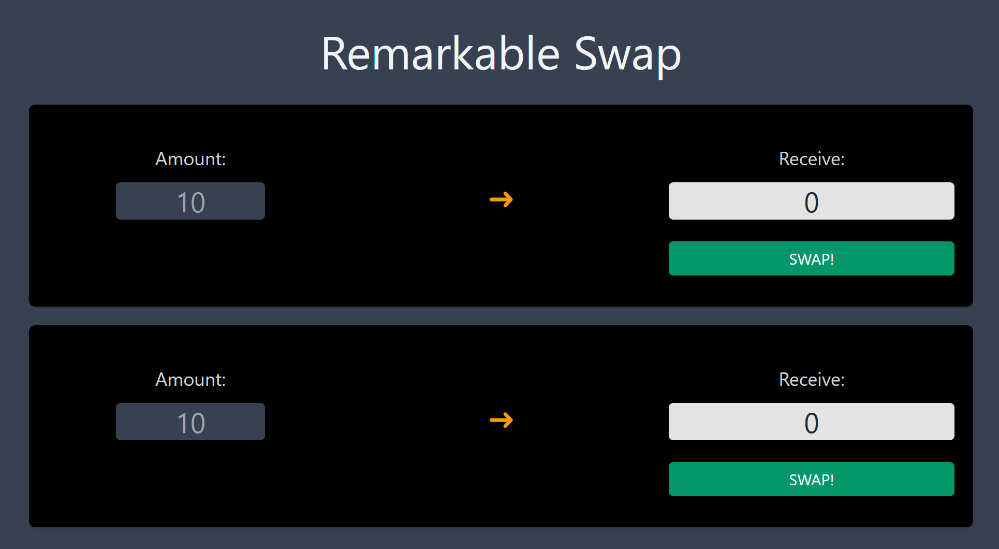

# MARKVELOUS DEX 

## Getting started

` Install deps with yarn `yarn` or npm `npm install`
` Start hardhat `npx hardhat node --watch`

`cd frontend` 

`npm install`

sign in to Metamask
Set up RPC to http://localhost:8545

`npm start`

The frontend should preview at http://localhost:3000/

